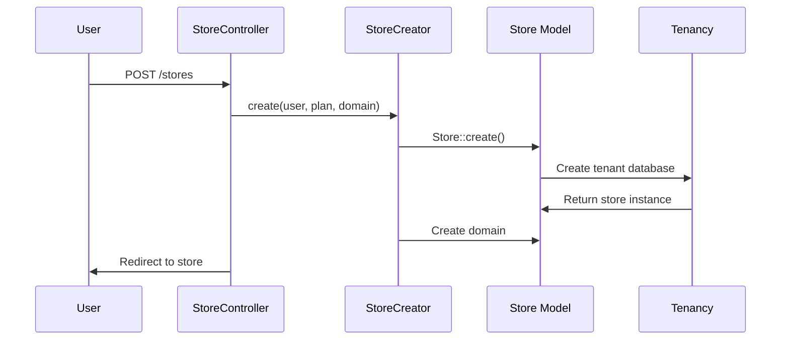
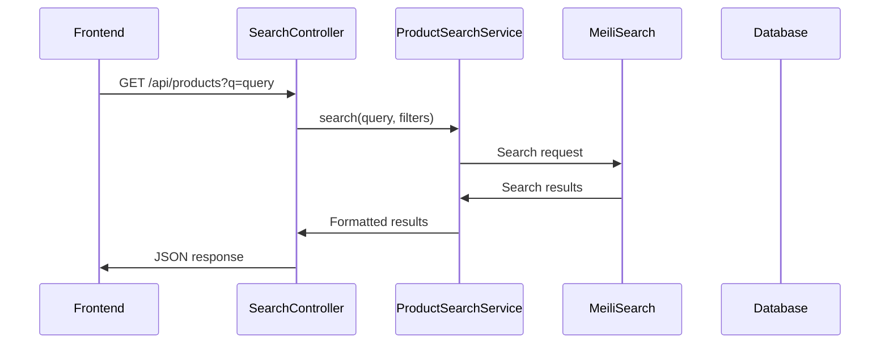

# Архитектура SaaS E-commerce Platform

## 🏗️ Общая архитектура

### Мультитенантная архитектура

Проект построен на принципах мультитенантности с использованием пакета `stancl/tenancy`. Каждый клиент (магазин) имеет:

- **Отдельную базу данных** - полная изоляция данных
- **Уникальный домен** - кастомный домен или субдомен
- **Изолированные файлы** - отдельное хранилище медиа
- **Независимый кеш** - изолированное кеширование

### Схема архитектуры

```
┌─────────────────┐    ┌─────────────────┐    ┌─────────────────┐
│   Central App   │    │   Tenant 1      │    │   Tenant 2      │
│                 │    │                 │    │                 │
│ ┌─────────────┐ │    │ ┌─────────────┐ │    │ ┌─────────────┐ │
│ │ Central DB  │ │    │ │ Tenant DB 1 │ │    │ │ Tenant DB 2 │ │
│ │ - Users     │ │    │ │ - Products  │ │    │ │ - Products  │ │
│ │ - Stores    │ │    │ │ - Categories│ │    │ │ - Categories│ │
│ │ - Plans     │ │    │ │ - Orders    │ │    │ │ - Orders    │ │
│ └─────────────┘ │    │ └─────────────┘ │    │ └─────────────┘ │
│                 │    │                 │    │                 │
│ ┌─────────────┐ │    │ ┌─────────────┐ │    │ ┌─────────────┐ │
│ │ Domain:     │ │    │ │ Domain:     │ │    │ │ Domain:     │ │
│ │ saasapp.com │ │    │ │ store1.com  │ │    │ │ store2.com  │ │
│ └─────────────┘ │    │ └─────────────┘ │    │ └─────────────┘ │
└─────────────────┘    └─────────────────┘    └─────────────────┘
```

## 📦 Слои приложения

### 1. Presentation Layer (Представление)

#### Frontend (Vue.js SPA)
- **Файлы**: `resources/js/components/`
- **Архитектура**: Single Page Application
- **Маршрутизация**: Vue Router
- **Состояние**: Pinia (планируется)

#### Backend API
- **Контроллеры**: `app/Http/Controllers/`
- **Ресурсы**: `app/Http/Resources/`
- **Middleware**: `app/Http/Middleware/`

### 2. Application Layer (Приложение)

#### Сервисы
- **StoreCreator**: Создание новых магазинов
- **SearchService**: Поисковая логика
- **ProductSearchService**: Специализированный поиск товаров

#### Команды
- **Console Commands**: `app/Console/Commands/`
- **Tenant Commands**: Специальные команды для тенантов

### 3. Domain Layer (Домен)

#### Модели
- **Store**: Основная модель тенанта
- **Product**: Товары с поиском и медиа
- **Category**: Древовидные категории
- **User**: Пользователи системы

#### События и слушатели
- **Events**: `app/Events/`
- **Listeners**: `app/Listeners/`

### 4. Infrastructure Layer (Инфраструктура)

#### База данных
- **Миграции**: `database/migrations/`
- **Сидеры**: `database/seeders/`
- **Фабрики**: `database/factories/`

#### Внешние сервисы
- **MeiliSearch**: Поисковый движок
- **Media Library**: Управление медиа
- **MoonShine**: Админ-панель

## 🔄 Поток данных

### Создание магазина



### Поиск товаров



## 🗄️ Модель данных

### Центральная база данных

```sql
-- Пользователи системы
users
├── id (PK)
├── name
├── email
├── password
└── created_at, updated_at

-- Магазины (тенанты)
stores
├── id (PK)
├── user_id (FK -> users.id)
├── plan (Free, Basic, Pro)
├── slug
├── theme_id (FK -> themes.id)
└── created_at, updated_at

-- Домены магазинов
domains
├── id (PK)
├── tenant_id (FK -> stores.id)
├── domain
└── created_at, updated_at

-- Планы подписки
plans
├── id (PK)
├── name
├── price
├── features
└── created_at, updated_at
```

### Тенантская база данных

```sql
-- Товары
products
├── id (PK)
├── name
├── slug
├── description
├── price
├── stock
├── category_id (FK -> categories.id)
├── tenant_id (автоматически)
└── created_at, updated_at, deleted_at

-- Категории
categories
├── id (PK)
├── name
├── slug
├── parent_id (self-referencing)
├── sort_order
├── tenant_id (автоматически)
└── created_at, updated_at

-- Заказы
orders
├── id (PK)
├── user_id (FK -> users.id)
├── total
├── status
├── tenant_id (автоматически)
└── created_at, updated_at

-- Элементы заказов
order_items
├── id (PK)
├── order_id (FK -> orders.id)
├── product_id (FK -> products.id)
├── quantity
├── price
└── created_at, updated_at
```

## 🔐 Безопасность

### Мультитенантная изоляция

1. **Database Isolation**
   - Каждый тенант имеет отдельную БД
   - Автоматическое добавление `tenant_id` в запросы
   - Global scopes для автоматической фильтрации

2. **File System Isolation**
   - Отдельные диски для каждого тенанта
   - Изолированное хранение медиа-файлов
   - Автоматическое переключение дисков

3. **Cache Isolation**
   - Тенант-специфичные теги кеша
   - Изолированное кеширование данных
   - Автоматическая очистка при смене тенанта

### Middleware Stack

```php
// Центральные маршруты
Route::middleware(['web', 'auth'])->group(function () {
    // Создание магазинов, управление аккаунтом
});

// Тенантские маршруты
Route::middleware([
    'web',
    InitializeTenancyByDomain::class,
    PreventAccessFromCentralDomains::class,
])->group(function () {
    // Каталог, поиск, корзина
});
```

## 🚀 Производительность

### Оптимизации

1. **Поиск**
   - MeiliSearch для быстрого поиска
   - Индексация только нужных полей
   - Фасеточная фильтрация

2. **Кеширование**
   - Redis для кеша
   - Тенант-специфичные теги
   - Автоматическая инвалидация

3. **Медиа**
   - CDN-ready структура
   - Автоматическая оптимизация изображений
   - Ленивая загрузка

### Мониторинг

- **Логи**: Laravel Logging
- **Метрики**: Встроенные метрики Laravel
- **Отладка**: Laravel Telescope (опционально)

## 🔧 Конфигурация

### Основные конфигурационные файлы

1. **`config/tenancy.php`**
   - Настройки мультитенантности
   - Конфигурация баз данных
   - Настройки файловой системы

2. **`config/scout.php`**
   - Конфигурация поиска
   - Настройки MeiliSearch
   - Индексы для моделей

3. **`config/media-library.php`**
   - Настройки медиа-библиотеки
   - Конфигурация дисков
   - Оптимизация изображений

### Переменные окружения

```env
# База данных
DB_CONNECTION=mysql
DB_HOST=db
DB_PORT=3306
DB_DATABASE=saasapp
DB_USERNAME=root
DB_PASSWORD=password

# Поиск
MEILISEARCH_HOST=http://meilisearch:7700
MEILISEARCH_KEY=masterKey

# Приложение
APP_NAME="SaaS E-commerce"
APP_ENV=local
APP_DEBUG=true
APP_URL=http://localhost:8000

# Кеш
CACHE_DRIVER=redis
REDIS_HOST=redis
REDIS_PORT=6379
```

## 📈 Масштабирование

### Горизонтальное масштабирование

1. **База данных**
   - Репликация для чтения
   - Шардинг по тенантам
   - Connection pooling

2. **Приложение**
   - Load balancer
   - Множественные экземпляры
   - Shared storage для файлов

3. **Поиск**
   - Кластеризация MeiliSearch
   - Репликация индексов
   - Распределенная обработка

### Вертикальное масштабирование

1. **Ресурсы сервера**
   - Увеличение CPU/RAM
   - SSD диски
   - Оптимизация PHP

2. **Оптимизация кода**
   - Профилирование
   - Кеширование запросов
   - Ленивая загрузка

## 🔄 CI/CD

### Pipeline

1. **Тестирование**
   - Unit тесты
   - Feature тесты
   - Browser тесты

2. **Сборка**
   - Composer install
   - NPM build
   - Docker image

3. **Развертывание**
   - Blue-green deployment
   - Database migrations
   - Cache clearing

### Мониторинг

- **Health checks**
- **Error tracking**
- **Performance monitoring**
- **Uptime monitoring**
