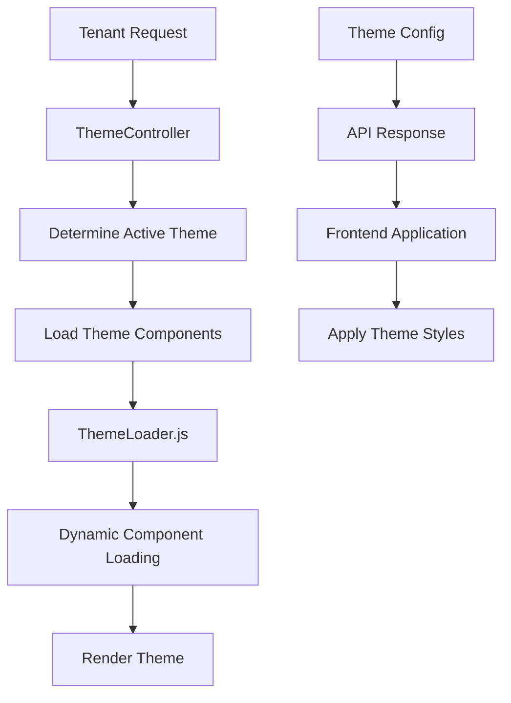

# 📚 Документация системы тем

Добро пожаловать в документацию по системе тем "Theme as a Package" для SaaS E-commerce платформы!

## 🎯 О системе

Система тем "Theme as a Package" обеспечивает полную изоляцию и динамическую загрузку тем для мультитенантных e-commerce приложений. Каждая тема является самостоятельным пакетом с собственными компонентами, стилями и конфигурацией.

### ✨ Основные возможности

- 🎨 **Полная кастомизация** - создавайте уникальные темы для каждого магазина
- ⚡ **Высокая производительность** - lazy loading и кэширование компонентов
- 🔧 **Гибкая конфигурация** - настройка цветов, макета и функциональности
- 🏢 **Мультитенантность** - разные темы для разных арендаторов
- 🛡️ **Безопасность** - изоляция и валидация тем
- 📱 **Адаптивность** - поддержка всех устройств

## 📖 Документация

### 🚀 Быстрый старт

| Документ | Описание |
|----------|----------|
| **[THEMES.md](THEMES.md)** | 📋 **Полное руководство** - архитектура, компоненты, API |
| **[THEME_CREATION_GUIDE.md](THEME_CREATION_GUIDE.md)** | 🎨 **Создание тем** - пошаговое руководство для разработчиков |

### 📚 Справочники

| Документ | Описание |
|----------|----------|
| **[API_REFERENCE.md](API_REFERENCE.md)** | 🌐 **API справочник** - все эндпоинты и примеры |
| **[FAQ.md](FAQ.md)** | ❓ **Часто задаваемые вопросы** - решения типовых проблем |

### 🔄 Миграция

| Документ | Описание |
|----------|----------|
| **[MIGRATION_GUIDE.md](MIGRATION_GUIDE.md)** | 📦 **Руководство по миграции** - перенос с старых систем тем |

## 🏃‍♂️ Быстрый старт

### 1. Установка

```bash
# Выполните миграции
php artisan migrate:fresh --seed

# Сканируйте темы
php artisan theme:manage scan

# Постройте фронтенд
npm install && npm run build
```

### 2. Создание первой темы

```bash
# Создайте новую тему
php artisan make:theme "My First Theme"

# Результат:
# themes/themes/my-first-theme/
# ├── theme.json
# ├── resources/js/
# └── README.md
```

### 3. Тестирование

```bash
# Проверьте API
curl http://localhost:8000/api/tenant/active-theme

# Список всех тем
php artisan theme:manage list
```

## 🛠️ Архитектура

### Структура проекта

```
├── app/
│   ├── Http/Controllers/Api/
│   │   ├── ThemeController.php      # API для управления темами
│   │   ├── ProductController.php    # API товаров
│   │   └── CategoryController.php   # API категорий
│   ├── Models/
│   │   ├── Theme.php               # Модель темы
│   │   └── Store.php               # Модель магазина
│   └── Services/
│       └── ThemeManager.php        # Сервис управления темами
├── themes/themes/                  # Директория тем
│   ├── default/                   # Тема по умолчанию
│   │   ├── theme.json
│   │   └── resources/js/
│   └── minimal/                   # Минималистичная тема
├── resources/js/
│   ├── themeLoader.js             # Загрузчик тем
│   ├── components/
│   │   └── ThemeComponent.vue     # Динамический компонент
│   └── tenant.js                  # Инициализация приложения
└── docs/                          # Документация
    ├── THEMES.md
    ├── API_REFERENCE.md
    └── FAQ.md
```

### Поток данных



## 🎨 Примеры использования

### Создание компонента темы

```vue
<!-- themes/themes/my-theme/resources/js/components/ProductCard.vue -->
<template>
  <div class="product-card">
    
    <h3>{{ product.name }}</h3>
    <p class="price">{{ formatPrice(product.price) }}</p>
    <button @click="addToCart" class="btn btn-primary">
      В корзину
    </button>
  </div>
</template>

<script>
import { useThemeConfig } from '../composables/useThemeConfig.js'

export default {
  name: 'ProductCard',
  props: {
    product: {
      type: Object,
      required: true
    }
  },
  setup() {
    const { themeConfig } = useThemeConfig()
    
    const formatPrice = (price) => {
      return new Intl.NumberFormat('ru-RU', {
        style: 'currency',
        currency: 'RUB'
      }).format(price)
    }
    
    const addToCart = () => {
      // Логика добавления в корзину
    }
    
    return {
      themeConfig,
      formatPrice,
      addToCart
    }
  }
}
</script>

<style scoped>
.product-card {
  background: var(--color-surface);
  border-radius: 8px;
  padding: 1rem;
  box-shadow: var(--shadow-md);
  transition: var(--transition-base);
}

.product-card:hover {
  transform: translateY(-4px);
  box-shadow: var(--shadow-lg);
}

.price {
  font-size: 1.25rem;
  font-weight: 700;
  color: var(--color-primary);
}

.btn-primary {
  background: var(--color-primary);
  color: white;
  border: none;
  padding: 0.75rem 1.5rem;
  border-radius: 4px;
  cursor: pointer;
  transition: var(--transition-fast);
}

.btn-primary:hover {
  background: var(--color-accent);
}
</style>
```

### API запросы

```javascript
// Получение активной темы
const getActiveTheme = async () => {
  const response = await fetch('/api/tenant/active-theme')
  return await response.json()
}

// Загрузка компонентов темы
const getThemeComponents = async () => {
  const response = await fetch('/api/theme/components')
  return await response.json()
}

// Поиск товаров
const searchProducts = async (query) => {
  const response = await fetch(`/api/products/search?q=${encodeURIComponent(query)}`)
  return await response.json()
}
```

## 🔗 Полезные ссылки

### 📋 Основная документация
- [Полное руководство по темам](THEMES.md) - начните здесь!
- [Создание новой темы](THEME_CREATION_GUIDE.md) - для разработчиков тем
- [API справочник](API_REFERENCE.md) - все эндпоинты и примеры

### 🛠️ Инструменты разработчика
- [Миграция с старых систем](MIGRATION_GUIDE.md)
- [Часто задаваемые вопросы](FAQ.md)

### 📞 Поддержка
- **GitHub Issues:** [Сообщить об ошибке](https://github.com/your-repo/issues)
- **Email:** support@yourcompany.com
- **Документация:** Актуальная версия всегда доступна в папке `/docs`

## 🏷️ Версионирование

| Версия | Дата | Изменения |
|--------|------|-----------|
| **v1.0.0** | 2024-01-01 | 🎉 Первый релиз системы тем |
| **v1.1.0** | 2024-02-01 | ✨ Добавлена поддержка TypeScript |
| **v1.2.0** | 2024-03-01 | 🚀 Улучшения производительности |

## 📄 Лицензия

Эта система тем распространяется под лицензией MIT. См. файл `LICENSE` для подробностей.

---

**Успешной разработки с системой тем!** 🚀

*Если у вас есть вопросы или предложения, не стесняйтесь обращаться к команде разработки.*